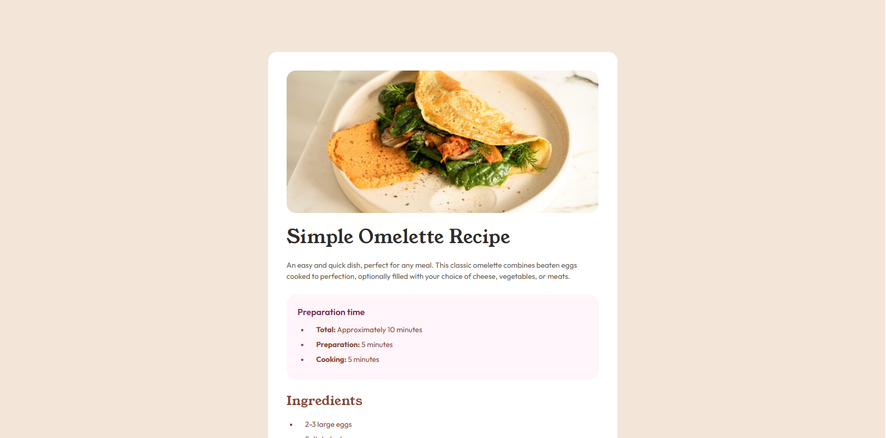

# Frontend Mentor - Recipe page solution

This is a solution to the [Recipe page challenge on Frontend Mentor](https://www.frontendmentor.io/challenges/recipe-page-KiTsR8QQKm). Frontend Mentor challenges help you improve your coding skills by building realistic projects. 

## Table of contents

- [Overview](#overview)
  - [Screenshot](#screenshot)
  - [Links](#links)
- [My process](#my-process)
  - [Built with](#built-with)
  - [What I learned](#what-i-learned)
  - [Continued development](#continued-development)
  - [Useful resources](#useful-resources)

## Overview

### Screenshot



### Links

- Solution URL: (https://github.com/jcuacuas/recipe-sample-page)
- Live Site URL: (https://jcuacuas.github.io/recipe-sample-page/)

## My process

### Built with

- Semantic HTML5 markup
- CSS custom properties
- Desktop-first workflow
- BEM naming convention

### What I learned

I learned its helpful to reduce the amount of repetitive code. At fist I was selecting each element and applying color styling to each.
After looking through my code, I thought it would be much easier to understand if I were to just put the same css styles on a single 
class instead of each individual element. It also made editing the css easier.

```css
.text--primary{
    color: var(--color-stone-600);
}

.text--secondary {
    color: var(--color-brown-800);
}
```

### Continued development

Looking back on some of my old work, I realize its important that the code is readable so I really want to focus on that going forward.
I've used only basic html and css to create these sites, in the next one I might try using react or vue.

### Useful resources

- [Stack Overflow](https://stackoverflow.com/questions/10040842/add-border-bottom-to-table-row-tr) - I could not figure out how to add the line separators in the nutrition table section. Stack Overflow really helped me find an easy solution.

## Author

- Frontend Mentor - [@jcuacuas](https://www.frontendmentor.io/profile/jcuacuas)
- Github - [@jcuacuas](http://github.com/jcuacuas)